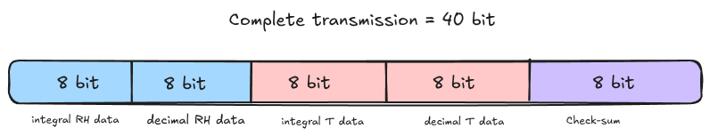
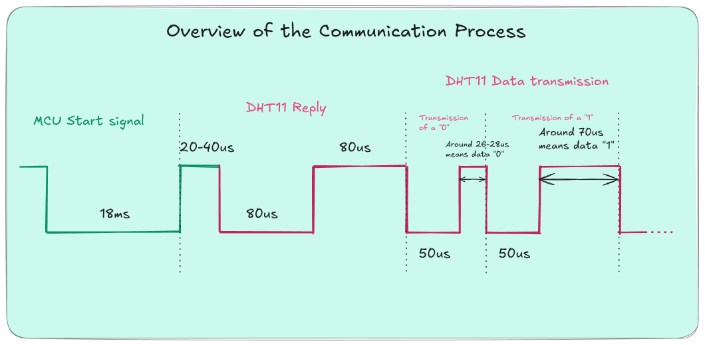
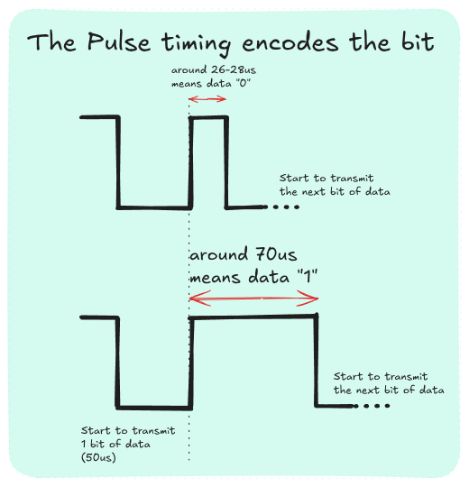

# Driver for the DHT11

Usage:

Note that there is an example in src/main.cpp

1. Include the library

```c++
#include "DHT11/driver.h"
```
2. Modify hardware.h to suit your hardware. The implemented version uses the Arduino framework and selects pin 5 of the board.

3. Ask for a measurement

> Advice from the manufacturer: Wait at least 1 second after supplying power to the sensor before you try to read it to avoid the unstable operation region.
```c++
dht11::ReadResult reading = dht11::get_sensor_reading(pin, sensor_clock);
```


## Understanding the Output
The output packages both the data and an error message that can be used for trouble shooting. Here is how to access each one of them:

```c++
double relativeHumidity = reading.measurement.RH;
double Temperature = reading.measurement.Temperature;
ReadError error = reading.error;
```
The error can be the following:
- none: no error during the transmission
- handshake_timeout: The microcontroller tried to stablish communication with the sensor but the sensor did not send an appropriate response signal.

- data_timeout: Timeout ocurred when listening to the pulses that encode the data.

- Invalid_pulse: The pulses captured have invalid length.

- checksum_mismatch: The data must be corrupted since the check sum does not equal the first byte of the resulting number of the sum of the bytes.


## Summary of the Communication Process

- Communication Process: Serial Interface (Single-Wire Two-Way)
	- The data transfer process is about 4 ms
	- The data wire is normally high. Connected to a pull-up resistor to 5 V.
	
	- Format of a complete data transmission:
		- The check sum byte should amount to the last 8 bits of the sum: "8 bit integral RH data + 8 bit decimal RH data + 8 bit integral T data + 8 bit decimal T data". `checksum = (byte0 + byte1 + byte2 + byte3) & 0xFF`


    
- Short overview of the communication sequence:
    1. MCU sends a start signal and waits for the response of the sensor.
    2. The sensor sends a reply
    3. The sensor starts transmitting the data (data is encoded in the duration of the second pulse)




So data is encoded in the duration of the second pulse during the data transmission stage of the communication. For a closer view check the image below.




